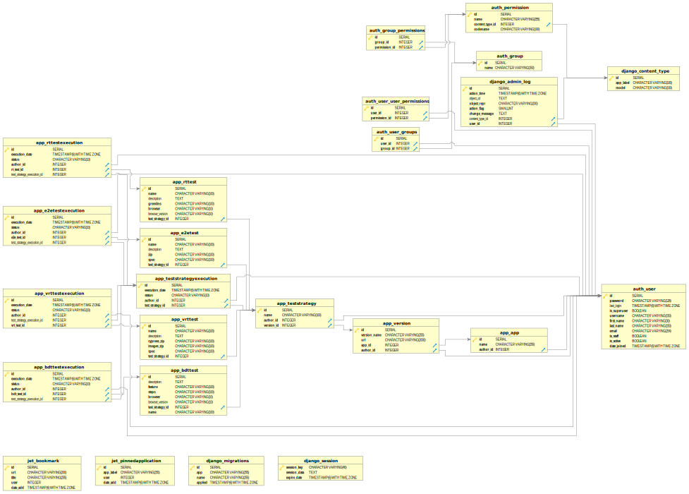

# miso-4208-proyecto

Se decidió realizar los diferentes componentes únicamente para aplicaciones web y con una interfaz gráfica. Lo anterior teniendo en cuenta que el presupuesto asociado al proyecto son de aporximadamente 8h/hombre y 8h/máquina a la semana, contando únicamente con una persona para el proyecto.

# Arquitectura

La arquitectura se varió, pues al agregar la interfaz gráfica fue necesario re plantear los componentes. No obstante, los cambios no fueron muy drasticos, principalmente, se agregó el componente de la interfaz gráfica y un dispatcher que se encarga de escuchar constantemente a la base de datos, para poder enviar a la cola de trabajo las ejecuciones. 

Sobre el diagrama de despliegue, dado que los componentes variaron, el despliegue también. La principal diferencia acá es la ausencia de google. Otra cosa importante a destacar es que actualmente todos los componentes los estoy ejecutando sobre mi computador personal, pero este diagrama representa el ideal. Pero, debido a problemas de puertos con las máquinas virtuales de la universidad, esto ha sido imposible hasta el momento.

# API Gateway

Debido a que no se cuenta con una interfaz gráfica, se piensa desarrollar un API Gateway que permita al usuario interactuar con los workers a través de la cola de mensajes. Aunque, se podría evitar contar con la cola, haciendo que el API llegue a los worker directamente, se considera que esta no es una buena desición debido a que impactaría la escalabilidad de la aplicación.

> Este componente ya no tiene soporte

# Interfaz gráfica

Este componente se desarrollo utilizando `django` y cuenta con las opciones de crear usuarios, aplicaciones, versiones de aplicaciones, estrategias de pruebas con diferentes tipos de pruebas (E2E, Random, BDT, VRT y no funcionales) y, además, permite ejecutar las pruebas también.

# Dispatcher

Es básicamente un script desarrollado en `node.js` que se encarga de escuchar a la base de datos, para detectar cuando se realicen inserciones dentro de las tablas de ejecuciones. Tan pronto las detecta, el dispatcher enviará a las colas de trabajo los datos que van a requerir los workers.

# Workers

Todos los workers se encuentran desarrollados en `node.js`. En general, reciben los archivos necesarios para poder ejecutar las pruebas y se comunican con el Dispatcher a través de la cola de mensajes. Con respecto a los workers de RT y BDT, se agregó soporte en la matriz de pruebas, permitiendo variar el navegador sobre el cual se van a ejecutar las pruebas y la versión del mismo.

## Workers actuales

Actualmente se cuenta con workers para pruebas E2E, Random, BDT, VRT y no funcionales (Lighthouse).

# Base de datos

Anteriormente, se estaba utilizando firestore como almacenamiento. Sin embargo, debido a la interfaz gráfica se decidió cambiar esto para utilizar postgresql. 

